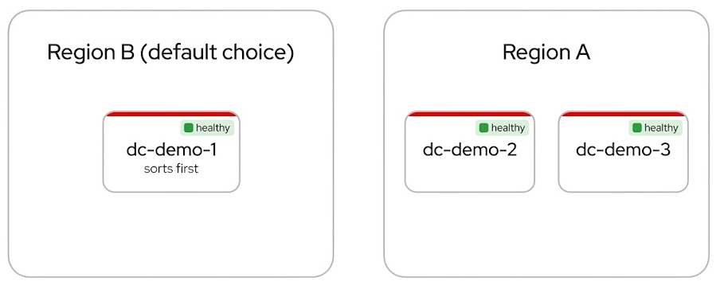
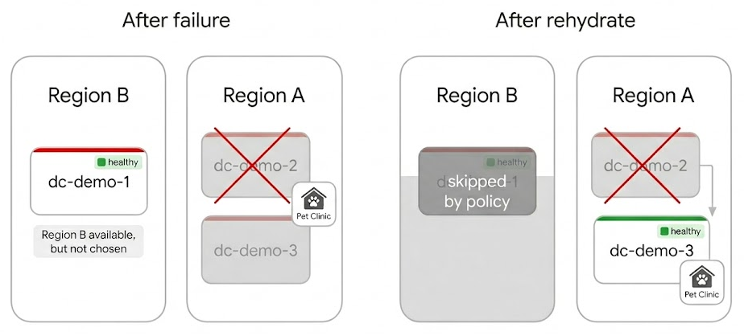

It is 2 a.m. when your on-call team gets an alert that a Region A datacenter is
down. The application holding customer data is unreachable, customers are
waiting, and someone in leadership is already asking for an ETA. The engineer
on duty opens the provider list and finds a healthy datacenter in Region B at
the top. If you are only looking at infrastructure health, that is where you
would send the workload next.

The workload was never supposed to leave Region A. Whether the constraint comes
from GDPR, a data residency requirement, a customer contract, or an internal
policy, the rule is the same: data that lives in Region A does not belong in
Region B. Crossing that line during an outage is not a shortcut back to green.
It is the start of a compliance incident that can outlast the outage itself,
with audit work, legal review, and lost trust trailing behind it.

That is a hard call to make when everything is on fire. The healthy region is
staring you in the face. The compliant option is harder to find and easier to
second-guess. In most organizations, someone has to remember the rule out loud,
defend it, and hope nobody reaches for the faster path while the minutes tick
by.

The demo below walks through how DCM takes that call out of the incident. You
write the regional boundary into policy once and deploy with that intent. When
something breaks, rehydration replays the original request and lets the policy
engine choose the next home. Region B can stay healthy and first on the list.
The application still stays in Region A.

---

## The lab setup

We run the scenario on three datacenters split across two regions:

| Region | Datacenters | Notes |
| --- | --- | --- |
| **Region A** | `dc-demo-2`, `dc-demo-3` | Where the app is allowed to live |
| **Region B** | `dc-demo-1` | Healthy, but off limits for this workload |

All three start healthy. Here is the twist: **Region B sorts first.** If DCM
only picked the first available provider, every new deployment would land there
by default. That is exactly the trap the sovereignty policy is meant to prevent.



---

## One policy, enforced everywhere

The regional rule is a [Rego](https://www.openpolicyagent.org/docs/latest/policy-language/)
policy you create once in the DCM UI under **Policies → Create**. Name it
`Sovereignty Region Policy`, set type to `GLOBAL`, priority to `1`, and paste
the policy below.

You do not need to read every line to follow the demo. Here is the logic in
plain English:

### No region, no deploy

If the request does not specify a target region, the policy rejects it.
Sovereignty is mandatory from day one, not something you bolt on after an audit
finding.

### Only healthy providers in the right region

The policy asks the provider registry what is available, then filters the list.
Providers in the wrong region drop out, even if they are healthy. Providers in
the right region must also be `ready`. Region B never makes the shortlist for a
Region A workload.

### First match wins (within the region)

Among the survivors, the policy picks the first provider alphabetically. That
is why the initial deploy lands on `dc-demo-2`, and why failover moves to
`dc-demo-3` when `dc-demo-2` fails.


**What if an entire region goes down?**

If no healthy provider exists in the requested region, the request is rejected
with a clear error. DCM will not silently fail over across a regional boundary
to "help." That is the point. A hard failure is easier to explain to a
compliance officer than a quiet data residency violation.


{}

```rego
package provider.sovereignty

import rego.v1

spm_url := "http://control-plane:8080/api/v1alpha1/providers"

main := {"rejected": true, "rejection_reason": "spec.service_type is required"} if {
    not input.spec.service_type
}

main := {"rejected": true, "rejection_reason": "spec.metadata.labels.region is required for sovereignty placement"} if {
    input.spec.service_type
    not input.spec.metadata.labels.region
}

main := result if {
    service_type := replace(input.spec.service_type, "-", "_")
    requested_region := input.spec.metadata.labels.region

    response := http.send({
        "method": "GET",
        "url": sprintf("%s?type=%s", [spm_url, service_type]),
        "headers": {"Accept": "application/json"},
    })

    providers := response.body.providers

    region_providers := [p |
        some p in providers
        p.health_status == "ready"
        p.metadata.region_code == requested_region
    ]

    result := _providers_result(region_providers, service_type, requested_region)
}

_providers_result(providers, service_type, region) := {"rejected": true, "rejection_reason": msg} if {
    count(providers) == 0
    msg := sprintf("no ready providers in region '%s' for service type '%s'", [region, service_type])
}

_providers_result(providers, _, _) := {"rejected": false, "selected_provider": provider} if {
    count(providers) > 0
    sorted_names := sort([p.name | some p in providers])
    provider := sorted_names[0]
}
```

{}

---

## The demo, step by step

### 1. Deploy to Region A

Create a **Pet Clinic** instance from the **Instances** tab and choose
**Region A**. DCM evaluates the sovereignty policy, skips Region B, and places
the app on `dc-demo-2`.

Behind the scenes, DCM stores your original request. That stored intent is the
source of truth for everything that follows.

### 2. Simulate the outage

Take `dc-demo-2` offline (`podman stop` on the provider containers). Region B
is still healthy and still first on the list. In a typical setup, that is where
the story ends and the compliance review begins.

Here, the policy has already ruled Region B out.

### 3. Rehydrate

Rehydration replays the stored intent against current provider health and
policy. In the DCM UI, open **Instances**, find your Pet Clinic instance, and
click **Rehydrate** (the circular arrows in the actions column). You can also
run it from the CLI:

```shell
dcm catalog instance rehydrate <instance-uid>
```

DCM provisions a fresh resource on `dc-demo-3`. Same application identity. New
underlying infrastructure. Still inside Region A.



The app moved datacenters, not regions. Nobody edited a routing table. Nobody
made a judgment call about whether compliance could wait until morning.

---

## Why this architecture is different

Most platforms draw a hard line between **day-one placement** and **disaster
recovery**. Different workflows, different runbooks, different approval paths.
DCM treats them as the same operation:

| Scenario | What you do | What DCM does |
| --- | --- | --- |
| First deploy | Create a catalog instance | Evaluates policy, places the app |
| Datacenter failure | Rehydrate | Re-evaluates the same policy against current health |
| Planned migration | Rehydrate | Same code path, same policy engine |

**Initial placement, disaster recovery, and migration share one mechanism.**
The catalog instance holds your intent. The policy engine applies your rules.
Rehydration is replay, not a separate rebuild workflow invented for emergencies.

That consistency is what makes regional sovereignty hold at 2 a.m. the same way
it holds on a quiet Tuesday. The rules do not relax because the pager is loud.

---

## See it yourself

The best way to get a feel for the flow is our
[interactive walkthrough](https://interact.redhat.com/share/yFwS2KKEs4Zvjc3USx5j).
Click through the DCM UI at your own pace: explore the providers, create the
policy, deploy Pet Clinic, and watch where the app lands.

The walkthrough covers almost the entire scenario in the browser, including
rehydration from the **Instances** tab. The step that still needs a
terminal today is simulating the datacenter failure.
The guide flags that when you reach it.

Want to reproduce the full lab on your own hardware? You will need the
[DCM stack](/docs/getting-started/local-setup/), [three workload clusters with
region-tagged providers](https://github.com/dcm-project/control-plane/blob/main/deploy/RUN.md#running-with-service-providers)
(see [`SP_REGION`](https://github.com/dcm-project/k8s-container-service-provider#provider-identity)
for region metadata), and the [Pet Clinic catalog
item](https://github.com/dcm-project/control-plane/blob/main/deploy/docs/three-tier-app-kind.md)
configured with a [deployment region
field](/docs/user-guide/catalog-items/#fields-and-policy-evaluation). If you are
new to DCM, start with the walkthrough above and come back to the lab setup when
you are ready to go deeper.
