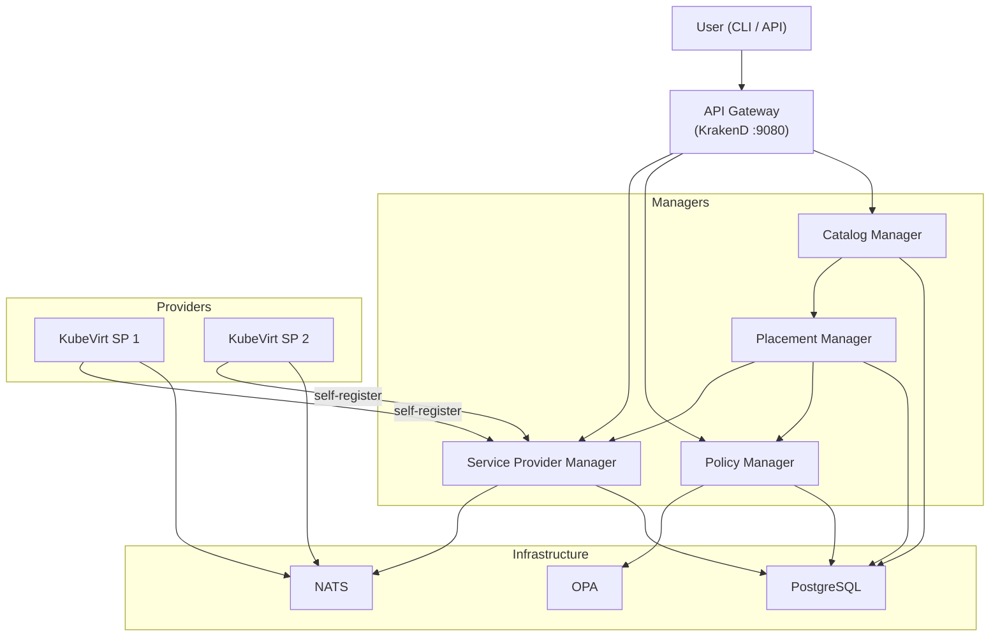
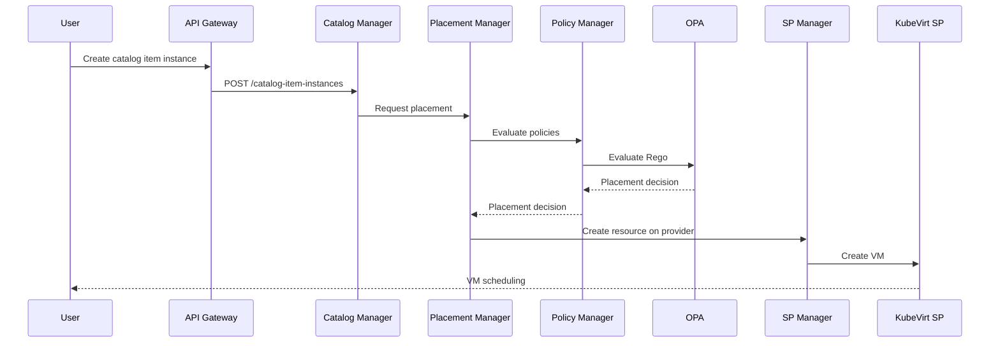

DCM (Data Center Management) is a control plane for managing infrastructure services across multiple providers. This page gives a high-level overview of how the components fit together.

## Components

## Component Responsibilities

| Component | Role |
|---|---|
| **API Gateway** | Single entry point for all API requests. Routes to the appropriate manager based on URL path. |
| **Catalog Manager** | Manages service types, catalog items, and catalog item instances. Triggers placement when an instance is created. |
| **Policy Manager** | Stores placement policies (Rego) and evaluates them via OPA. |
| **Placement Manager** | Selects a service provider for a new instance by evaluating policies against available providers. |
| **Service Provider Manager** | Tracks registered service providers and their health status. |
| **PostgreSQL** | Persistent storage for all managers. |
| **NATS** | Message bus for communication between the Service Provider Manager and service providers. |
| **OPA** | Evaluates Rego policies for placement decisions. |
| **Service Providers** | External systems (e.g., KubeVirt) that create and manage the actual resources (VMs, containers, etc.). |

## Request Flow

When a user creates a catalog item instance, the following happens:

1. The **Catalog Manager** receives the request and asks the **Placement Manager** to find a suitable provider.
2. The **Placement Manager** evaluates placement policies through the **Policy Manager** and **OPA**.
3. Once a provider is selected, the resource is created on that provider through the **Service Provider Manager**.
