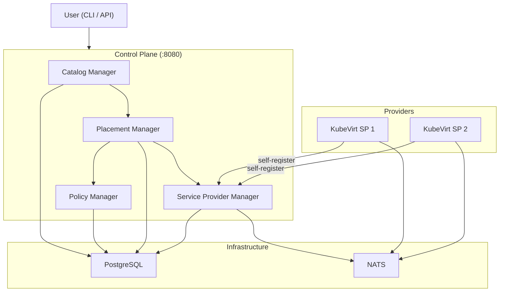
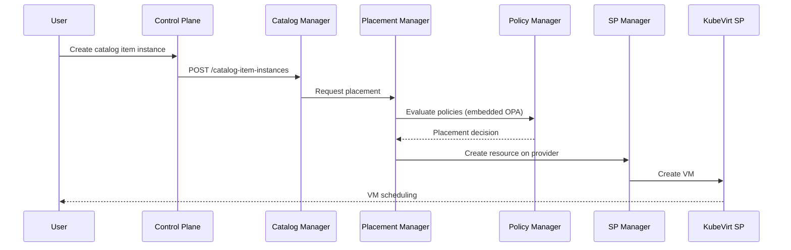

DCM (Data Center Management) is a control plane for managing infrastructure
services across multiple providers. This page gives a high-level overview of how
the components fit together.

## Components

## Component Responsibilities

| Component                    | Role                                                                                                                                    |
| ---------------------------- | --------------------------------------------------------------------------------------------------------------------------------------- |
| **Control Plane**            | Single process that exposes all DCM APIs on `:8080`. Hosts the catalog, policy, placement, and service provider managers in one binary. |
| **Catalog Manager**          | Manages service types, catalog items, and catalog item instances. Triggers placement when an instance is created.                       |
| **Policy Manager**           | Stores placement policies (Rego) and evaluates them via an embedded OPA engine.                                                         |
| **Placement Manager**        | Selects a service provider for a new instance by evaluating policies against available providers.                                       |
| **Service Provider Manager** | Tracks registered service providers and their health status.                                                                            |
| **PostgreSQL**               | Persistent storage for the control plane.                                                                                               |
| **NATS**                     | Message bus for communication between the Service Provider Manager and service providers.                                               |
| **Service Providers**        | External systems (e.g., KubeVirt) that create and manage the actual resources (VMs, containers, etc.).                                  |

## Request Flow

When a user creates a catalog item instance, the following happens:

1. The **Catalog Manager** receives the request and asks the **Placement
   Manager** to find a suitable provider.
2. The **Placement Manager** evaluates placement policies through the **Policy
   Manager**, which uses an embedded OPA engine to evaluate Rego.
3. Once a provider is selected, the resource is created on that provider through
   the **Service Provider Manager**.
